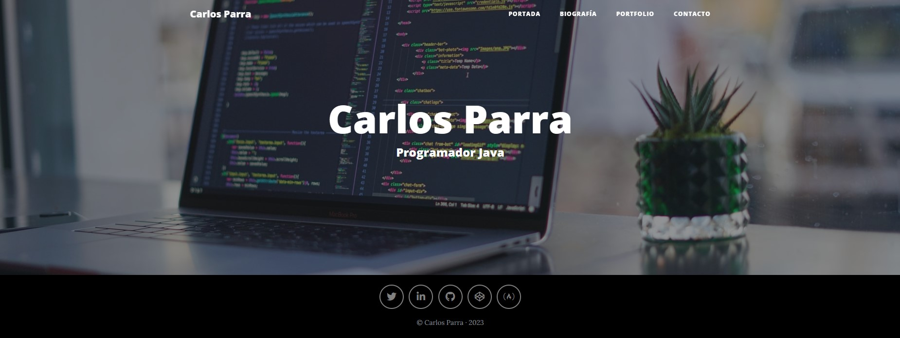
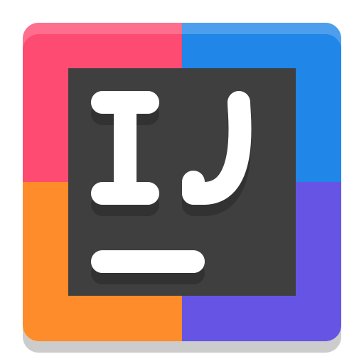
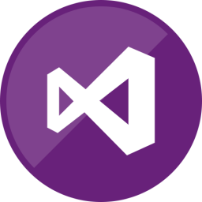
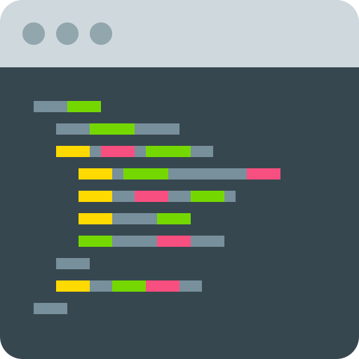
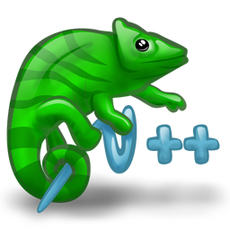

### Visita mi [portfolio][website] 👋

[][twitter]
[][website]

 

### Programador Junior desarrollando en Java 

- :point_right: Esforzándome cada día para mejorar

---

### Coding 
<!-- 
Iconos diseñados por <a href="https://www.freepik.com" title="Freepik">Freepik</a> from <a href="https://www.flaticon.es/" title="Flaticon">www.flaticon.es</a>
 -->

 

---
### IDEs 

 

---

### Editores de código 

 

---
### Estadísticas dinámicas 

---

<!-- LINKS -->
[website]: https://carlosparra.pythonanywhere.com/
[twitter]: https://twitter.com/acarlosparra/
[linkedIn]: https://es.linkedin.com/in/carlos-parra-gonz%C3%A1lez-24a50a163?trk=people-guest_people_search-card
